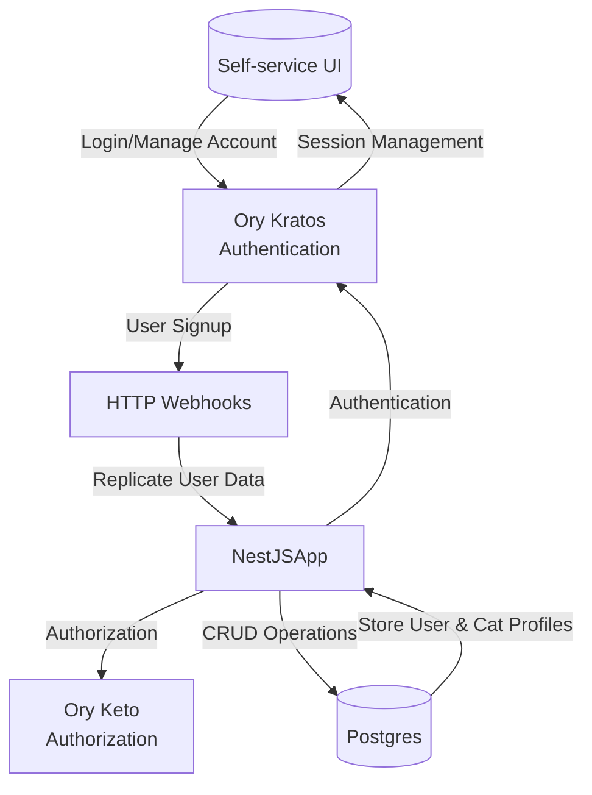
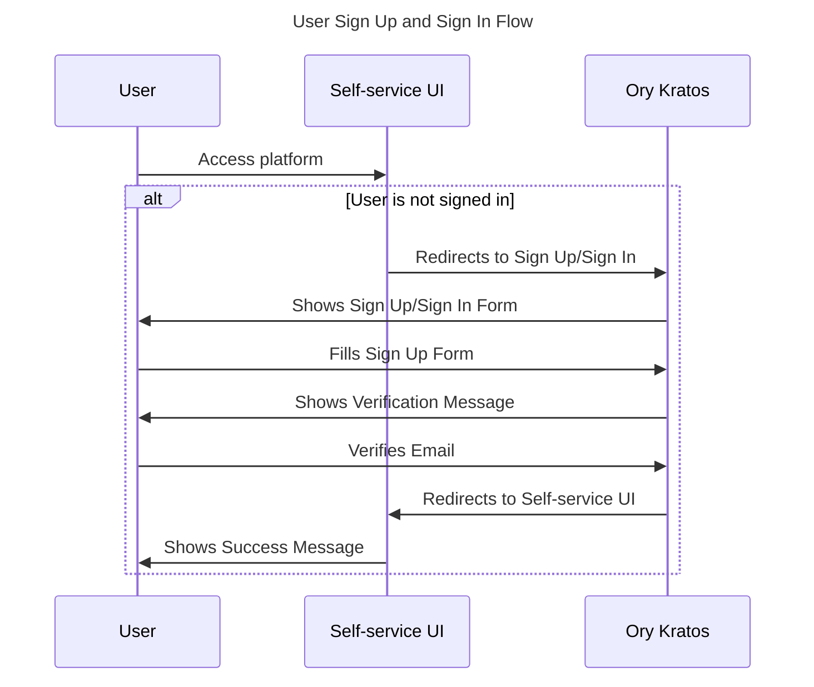
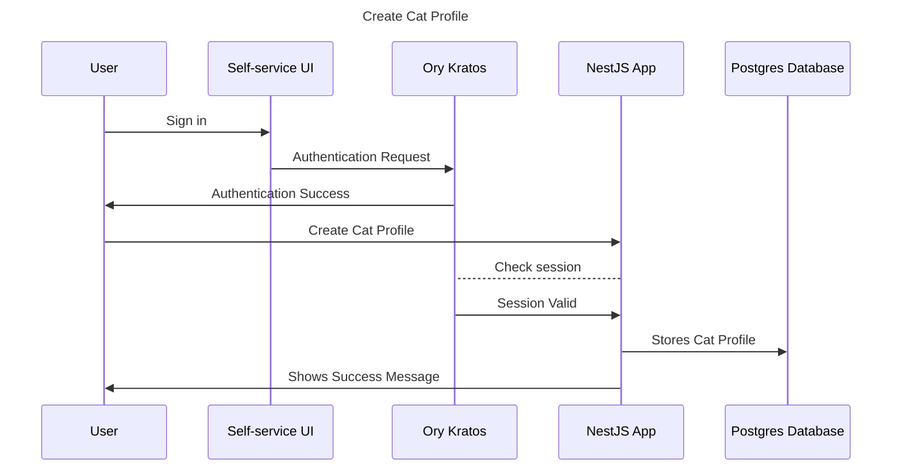
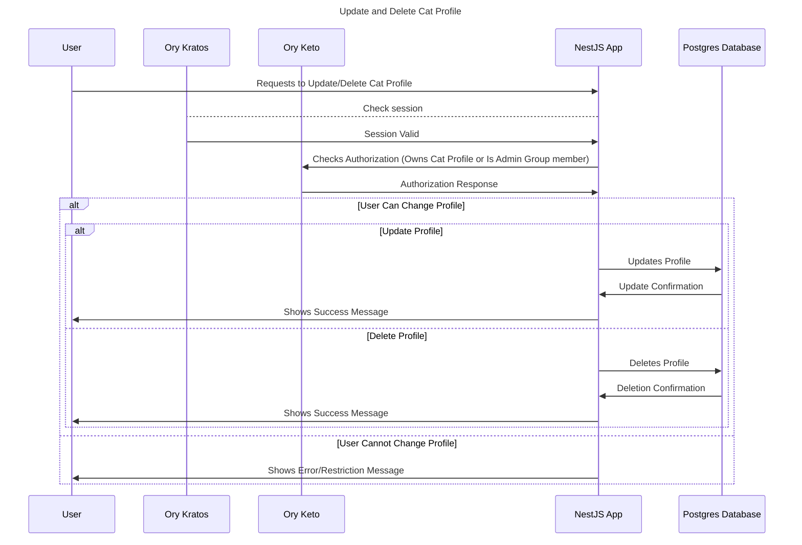
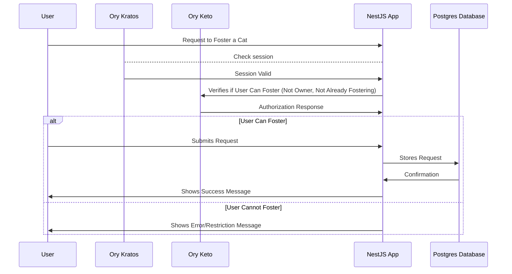
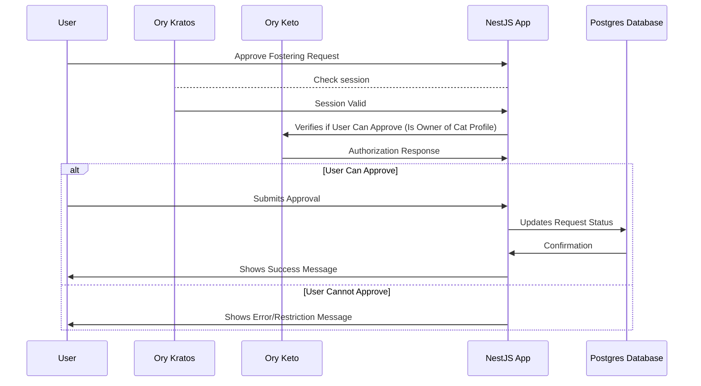
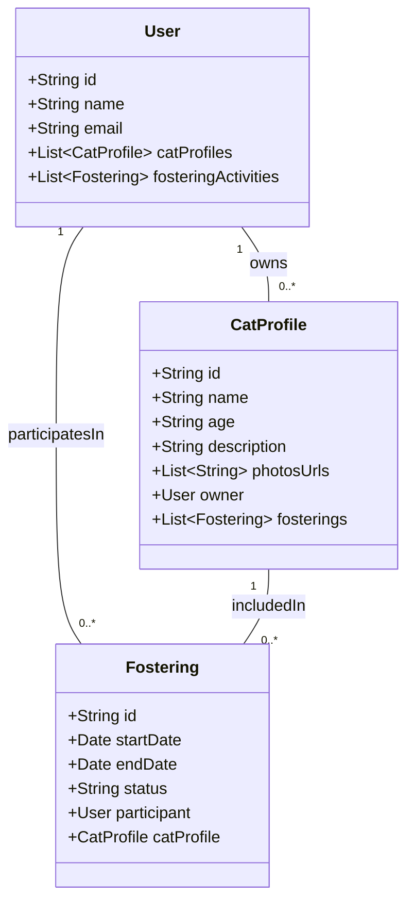
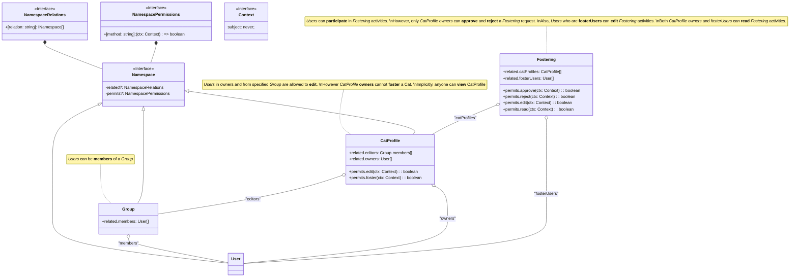

# CatFostering

This demonstration app is a web-based platform (REST API) called `CatFoster`. `CatFoster` serves as a community hub where cat owners who need temporary care for their pets can connect with cat lovers willing to foster animals in their homes.

> **Note**
> The [CatFoster](https://github.com/getlarge/cat-fostering/blob/main) application is a simplified example to demonstrate the integration of Ory in a NestJS application. The focus is on showcasing the authentication and authorization features of Ory within a real-world use case. The application will not cover frontend development and deployment, focusing solely on the backend implementation.

The journey to integrate Ory in the `CatFoster` application will be divided into three main phases:

1. **Design Phase:** We will outline the architecture, user flows, entities, and permissions for the `CatFoster` application. This phase will help us understand the requirements and functionalities of the application before diving into the implementation.

2. **Implementation Phase:** We will create a new [Nx](https://nx.dev) workspace, set up a NestJS application, configure [Ory Kratos](https://ory.sh/kratos) and Ory Keto using Docker Compose, and implement the necessary modules, services, controllers, and entities to integrate Ory into the CatFoster application.

3. **Testing Phase:** We will start with manual testing and then write end-to-end tests for the application by running the application locally. This phase will show how to set up an Ory environment for testing.

> **Note**
> If this is your first time working with Ory, I recommend reading the [Introduction to Ory](./Introduction-to-ory.md) article to familiarize yourself with the core components and concepts of Ory.

## Key Features

1. **User Authentication and Profile Management:**

   - **Ory Integration:** Utilize Ory's authentication system to handle user registrations, logins, password resets, and profile management.
   - **User Roles:** There is one static user role, `Admin`, that a super admin can assign to users after registration.

2. **Cat Profiles:**

   - **Listing and Management:** Cat owners can create profiles for their cats, including photos, descriptions, special care instructions, and availability for fostering. Admins can edit and delete cat profiles.
   - **Search and Filters:** Users looking to foster cats can search for them based on filters.

3. **Fostering Matchmaking:**

   - **Requests and Approvals:** Cat fosters can send fostering requests to cat owners, who can review and approve or deny them based on the foster's profiles.
   - **Authorization Checks:** Use Ory to manage authorization, ensuring that only cat owners can approve fostering requests and only registered users can send requests.

## Design phase

### Architecture

- **Self-service UI**: This is the frontend where users can log in and manage their accounts. It communicates directly with Ory Kratos for authentication-related tasks.
- **Ory Kratos**: Handles authentication. It's responsible for user login, account management, and session management. It interacts with the NestJS app via HTTP webhooks to replicate user data on signup.
- **HTTP Webhooks**: Serve as the communication link between Ory Kratos and the NestJS app, ensuring the user is replicated in the local database upon signup.
- **NestJS App**: The core of your application is handling business logic, CRUD operations with the Postgres database, authentication checks with Ory Kratos, and authorization with Ory Keto.
- **Ory Keto**: Manages authorization, determining what authenticated users are allowed to do within the application.
- **Postgres**: The database where user data (replicated from Ory on signup), cat profiles and fostering requests are stored. The NestJS app interacts with Postgres for all data storage and retrieval operations.

### User Flows

To visualize the user flow for the `CatFoster` project, we'll create a series of diagrams using [Mermaid](https://mermaid.js.org/) to illustrate the different interactions a user can have within the system. These interactions include signing up and signing in, creating a cat profile, updating and deleting their cat profiles, requesting to foster a cat, and approving fostering requests.

#### User Sign-Up and Sign-In Flow

#### Cat Profile Edition Flows

It all starts with the user creating a cat profile. Once the profile is created, the user (**owner** or member of **admin** group) can update or delete it. The following sequence diagrams illustrate these flows.

#### Request Fostering Flow

This flow ensures that users can request to foster a cat only if they meet specific criteria, such as not being the cat's owner and not already fostering this cat. This mechanism helps prevent conflicts and ensures a smooth fostering process.

#### Approve Fostering Request Flow

This flow ensures that only cat owners can approve fostering requests, maintaining control over who fosters their cats.

### Entities and Relationships

The diagram below represents the entities of CatProfile, User, and Fostering in your CatFoster application and illustrates their relationships. This diagram shows each entity's attributes and their associations, such as ownership and fostering relationships.

- **User:** Represents users of the system, which can be cat owners, fosters, or both. Attributes include basic user information like `id`, `name`, `email`. Relationships include `ownedCats`, a list of `CatProfile` entities that the user owns, and `fosteringActivities`, a list of `Fostering` entities indicating the cats they are fostering or have fostered.

- **CatProfile:** Represents the profiles of cats available for fostering. Attributes include the cat's `id`, `name`, `age`, `description`, `ownerId` (linking back to the `User` who owns the cat), and `photosUrls`, a list of URLs to photos of the cat. It has a relationship to `Fostering`, which indicates any fostering activities it's involved in.

- **Fostering:** Represents a fostering arrangement between a user (foster) and a cat. Attributes include `id`, `catId` (linking to the `CatProfile` being fostered), `fosterUserId` (linking to the `User` who is fostering the cat), `startDate`, `endDate`, and `status` (which can include states like pending, active, or completed).

### Permissions

In Ory Keto (the authorization component of Ory), developers can express relationships using the [Ory Permission Language](https://www.ory.sh/docs/keto/reference/ory-permission-language). You can compare them to [DDD Aggregates](https://martinfowler.com/bliki/DDD_Aggregate.html), where relations are defined between entities, and permissions are defined based on the context of the user and the entity with which they interact.

Ory uses the following terminology:

- **subjects**: users or groups interacting with the system (e.g., `User`)
- **objects**: entities in the system (e.g., `CatProfile`, `Fostering`)
- **relations**: associations between objects (e.g., `owns`, `participatesIn`, `includedIn`)
- **permissions**: actions that users can perform on objects (e.g., `edit`, `foster`, `approve`)

To manage access control in the `CatFoster` application, we will translate the user flows and entity relationships into Ory permissions:

> **Note**
> The permissions will be implemented using [Ory Permission Language Code](https://www.ory.sh/docs/keto/#ory-permission-language) in the following steps.

> **Note**
> The relations [are always defined as arrays](https://www.ory.sh/docs/keto/modeling/create-permission-model#define-relationships-in-the-opl) to allow multiple users or groups to be associated with a specific entity. The permissions are defined as functions that receive a context object and return a boolean value based on the user's authorization level.
