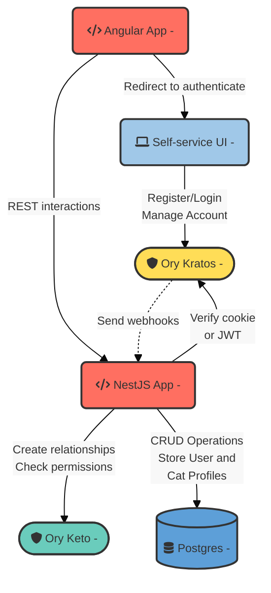

# CatFostering

This demonstration app is a web-based platform (REST API) called `CatFostering`. The CatFoster application is a simplified example that demonstrates the integration of [Ory](https://ory.sh) in a [NestJS](https://nestjs.com) application with the [NestJS Ory Integration libraries](https://github.com/getlarge/nestjs-ory-integration).

> **Note**
> If this is your first time working with Ory, I recommend reading the [Introduction to Ory](https://dev.to/getlarge/introduction-to-ory-47nh) article to familiarize yourself with the core components and concepts of Ory.

## Key Features

1. **User Authentication and Profile Management:**

   - **Ory Integration:** Utilize Ory's authentication system to handle user registrations, logins, password resets, and profile management.
   - **User Roles:** There is one static user role, `Admin`, that a super admin can assign to users after registration.

2. **Cat Profiles:**

   - **Listing and Management:** Cat owners can create profiles for their cats, including photos, descriptions, special care instructions, and availability for fostering. Admins can edit and delete cat profiles.
   - **Search and Filters:** Users looking to foster cats can search for them based on filters.

3. **Fostering Matchmaking:**

   - **Requests and Approvals:** Cat fosters can send fostering requests to cat owners, who can review and approve or deny them based on the foster's profiles.
   - **Authorization Checks:** Use Ory to manage authorization, ensuring that only cat owners can approve fostering requests and only registered users can send requests.

## Design phase

### Architecture

- **Self-service UI**: This is the frontend where users can log in and manage their accounts. It communicates directly with Ory Kratos for authentication-related tasks.
- **Ory Kratos**: Handles authentication. It's responsible for user login, account management, and session management. It interacts with the NestJS app via HTTP webhooks to replicate user data on signup.
- **HTTP Webhooks**: Serve as the communication link between Ory Kratos and the NestJS app, ensuring the user is replicated in the local database upon signup.
- **NestJS App**: The core of your application is handling business logic, CRUD operations with the Postgres database, authentication checks with Ory Kratos, and authorization with Ory Keto.
- **Ory Keto**: Manages authorization, determining what authenticated users are allowed to do within the application.
- **Postgres**: The database where user data (replicated from Ory on signup), cat profiles and fostering requests are stored. The NestJS app interacts with Postgres for all data storage and retrieval operations.

Check out the complete [Ory Integration guide](https://dev.to/getlarge/integrate-ory-in-a-nestjs-application-4llo) to learn how to integrate [Ory Kratos](https://github.com/ory/kratos) and [Ory Keto](https://github.com/ory/keto) into your NestJS application.
